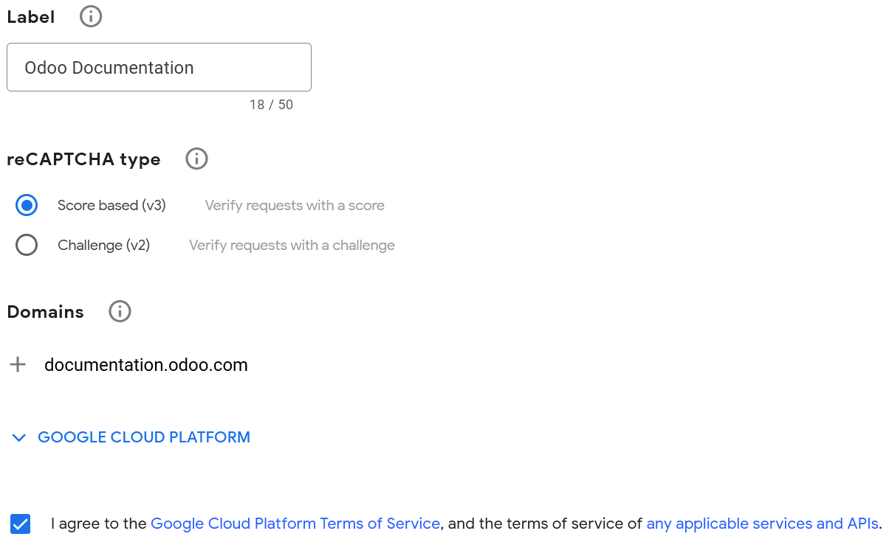

=====================
reCAPTCHA v3 on forms
=====================

Google's reCAPTCHA protects website forms from spam and abuse. It enables to distinguish between
human and automated submissions.

.. note::
   reCAPTCHA v3 works invisibly in the background and does not interrupt users.

.. seealso::
   `Google's reCAPTCHA v3 guide <https://developers.google.com/recaptcha/docs/v3>`_

Configuration
=============

On Google
---------

Open `the reCAPTCHA website registration page <https://www.google.com/recaptcha/admin/create>`_. Log
in or create a Google account if necessary.

On the website registration page:

- Give the website any :guilabel:`Label`.
- Leave the :guilabel:`reCAPTCHA type` on :guilabel:`Score based (v3)`.
- Enter one or more :guilabel:`Domains`.

.. note::
   - Registering a domain name (e.g., odoo.com) also registers any subdomain (e.g.,
     subdomain.odoo.com).
   - A valid domain requires a host and must not include any path, port, query or fragment.

- Under :guilabel:`Google Cloud Platform`, a project is automatically selected if one was already
  created with the logged in Google account. If not, one is automatically created. Click
  :guilabel:`Google Cloud Platform` to select a project yourself or rename the automatically created
  project.
- Agree to the terms of service.
- Click :guilabel:`Submit`.

A new page loads with the generated keys. Leave it open as copying the keys to Odoo is required
next.

.. note::
   Analytics and additional settings are available on `Google's reCAPTCHA administration page
   <https://www.google.com/recaptcha/admin/>`_. For example, you can receive alerts if Google
   detects suspicious traffic on your website.

On Odoo
-------

- From the database dashboard, click :guilabel:`Settings`. Under :guilabel:`Integrations`, enable
  :guilabel:`reCAPTCHA` if needed.
- Open the Google reCAPTCHA page, click :guilabel:`Copy site key` and paste it into the
  :guilabel:`Site Key` field in Odoo.
- Open the Google reCAPTCHA page, click :guilabel:`Copy secret key` and paste it into the
  :guilabel:`Secret Key` field in Odoo.
- Change the default :guilabel:`Minimum score` (`0.5`) if necessary, using a value between `1.0`
  (very likely a human, highest protection) and `0.0` (very likely a bot, no protection).
- Click :guilabel:`Save`.

.. warning::
   Do not uninstall the :guilabel:`Google reCAPTCHA integration` module, as many other modules will
   be removed in the process.

.. tip::
   You can notify visitors that a form is protected by reCAPTCHA. To do so, open the website editor
   and navigate to the form. Then, click somewhere on the form, and, on the right sidebar's
   :guilabel:`Customize` tab, toggle :guilabel:`Show reCAPTCHA Policy` found under the
   :guilabel:`Form` section.

   .. image:: recaptcha/recaptcha-policy.png
      :alt: reCAPTCHA policy message displayed on a form
